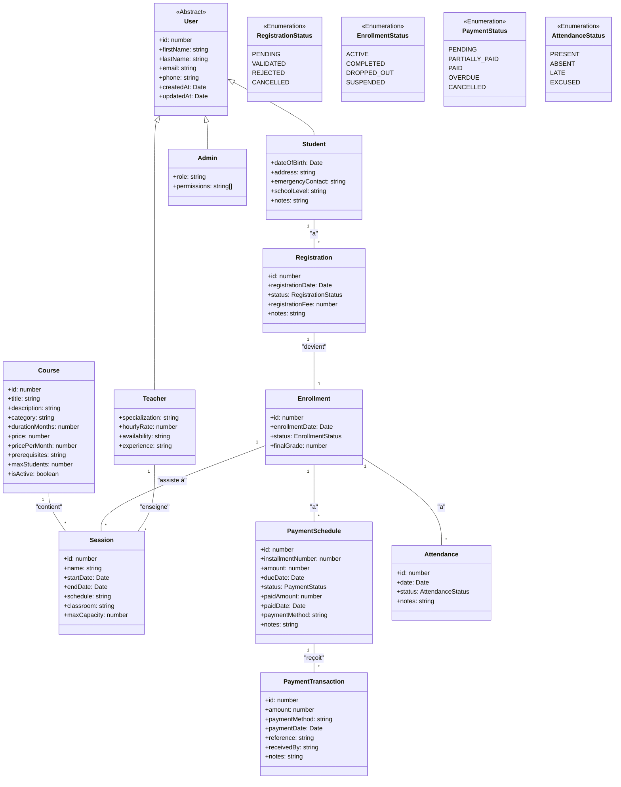
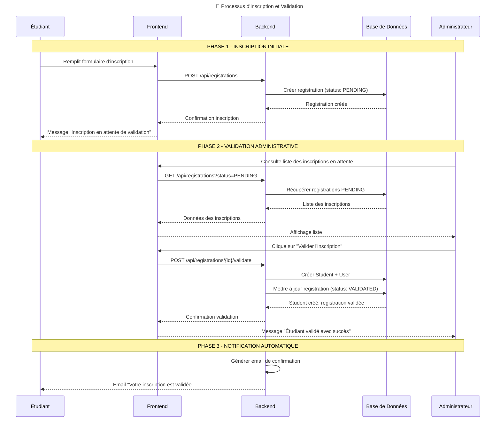
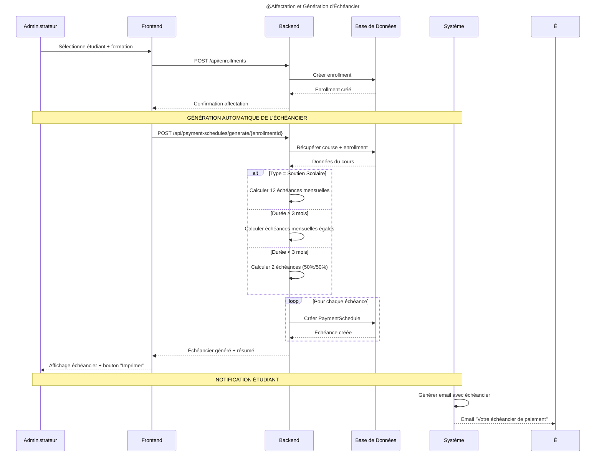
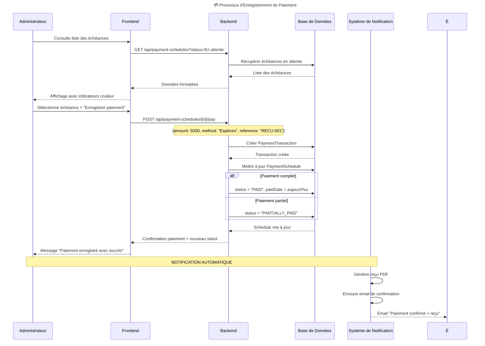
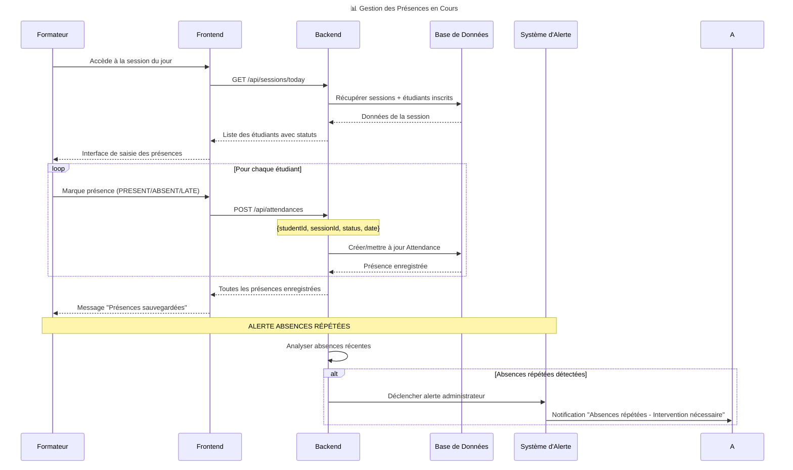

# 🎓 Système de Gestion Scolaire - Modélisation UML

## 📊 Diagramme de Classes



---

## 📋 Diagramme de Cas d'Utilisation

```mermaid
usecaseDiagram
    title 🎯 Cas d'Utilisation - Système de Gestion Scolaire

    %% ========== ACTEURS ==========
    
    actor Administrateur as "👨‍💼 Administrateur"
    actor Formateur as "👨‍🏫 Formateur" 
    actor Étudiant as "🎓 Étudiant"
    actor Parent as "👨‍👩‍👧‍👦 Parent"
    actor Système as "🤖 Système"

    %% ========== PAQUET DE GESTION ADMINISTRATIVE ==========
    
    package "Gestion Administrative" {
        usecase UC1 as "Gérer les étudiants"
        usecase UC2 as "Gérer les formateurs"
        usecase UC3 as "Gérer le catalogue de formations"
        usecase UC4 as "Valider les inscriptions"
        usecase UC5 as "Gérer les sessions de formation"
    }

    %% ========== PAQUET DE GESTION FINANCIÈRE ==========
    
    package "Gestion Financière" {
        usecase UC6 as "Générer les échéanciers"
        usecase UC7 as "Enregistrer les paiements"
        usecase UC8 as "Suivre les retards de paiement"
        usecase UC9 as "Générer les rapports financiers"
    }

    %% ========== PAQUET DE SUIVI PÉDAGOGIQUE ==========
    
    package "Suivi Pédagogique" {
        usecase UC10 as "Marquer les présences"
        usecase UC11 as "Saisir les notes"
        usecase UC12 as "Générer les bulletins"
        usecase UC13 as "Planifier les cours"
    }

    %% ========== PAQUET PORTAL ÉTUDIANT ==========
    
    package "Portal Étudiant" {
        usecase UC14 as "Consulter son emploi du temps"
        usecase UC15 as "Voir son échéancier"
        usecase UC16 as "Consulter ses notes"
        usecase UC17 as "Télécharger les ressources"
    }

    %% ========== ACTEURS PRINCIPAUX ==========

    Administrateur --> UC1
    Administrateur --> UC2  
    Administrateur --> UC3
    Administrateur --> UC4
    Administrateur --> UC5
    Administrateur --> UC6
    Administrateur --> UC7
    Administrateur --> UC8
    Administrateur --> UC9

    Formateur --> UC10
    Formateur --> UC11
    Formateur --> UC13

    Étudiant --> UC14
    Étudiant --> UC15
    Étudiant --> UC16
    Étudiant --> UC17

    %% ========== RELATIONS D'INCLUSION ==========

    UC6 .> UC7 : include
    UC11 .> UC12 : include
    
    %% ========== RELATIONS D'EXTENSION ==========
    
    UC8 .> UC9 : extend
    
    %% ========== SYSTÈME AUTOMATIQUE ==========
    
    Système --> UC18 as "Générer notifications automatiques"
    Système --> UC19 as "Mettre à jour statuts des paiements"
```

---

## 🔄 Diagramme de Séquence - Processus Complet

### Séquence 1: Inscription et Validation



### Séquence 2: Affectation et Génération d'Échéancier



### Séquence 3: Enregistrement d'un Paiement



### Séquence 4: Gestion des Présences



---

## 🎯 Spécifications des Cas d'Utilisation Détaillés

### UC1: Gérer les Étudiants
**Acteur principal**: Administrateur  
**Préconditions**: Utilisateur authentifié en tant qu'admin  
**Scénario principal**:
1. L'admin consulte la liste des étudiants
2. Le système affiche la liste avec filtres (actifs/inactifs)
3. L'admin peut créer un nouvel étudiant
4. Le système valide les données et crée le profil
5. L'admin peut modifier ou désactiver un étudiant

**Scénarios alternatifs**:
- Données invalides → Message d'erreur
- Email déjà existant → Proposition de fusion

### UC4: Valider les Inscriptions  
**Acteur principal**: Administrateur  
**Préconditions**: Inscriptions en statut PENDING existent  
**Scénario principal**:
1. L'admin consulte la liste des inscriptions en attente
2. Pour chaque inscription, il vérifie les pièces jointes
3. Il valide ou rejette l'inscription
4. Le système crée automatiquement l'étudiant si validé
5. Notification email envoyée à l'étudiant

### UC6: Générer les Échéanciers
**Acteur principal**: Système (automatique) / Administrateur  
**Déclencheur**: Nouvelle affectation créée  
**Scénario principal**:
1. Le système détecte une nouvelle affectation
2. Il récupère les informations du cours (type, durée, prix)
3. Selon le type de cours, il calcule le nombre d'échéances
4. Il génère les échéances avec dates et montants
5. Il enregistre l'échéancier en base de données

**Règles métier**:
- Soutien scolaire: 12 échéances mensuelles
- Formation ≥3 mois: Échéances mensuelles égales  
- Formation <3 mois: 2 échéances (50%/50%)

### UC7: Enregistrer les Paiements
**Acteur principal**: Administrateur  
**Préconditions**: Échéance existante en statut "En attente"  
**Scénario principal**:
1. L'admin sélectionne une échéance
2. Il saisit le montant payé, la méthode, la référence
3. Le système enregistre la transaction
4. Met à jour le statut de l'échéance
5. Génère un reçu PDF automatiquement

### UC10: Marquer les Présences
**Acteur principal**: Formateur  
**Préconditions**: Session planifiée pour aujourd'hui  
**Scénario principal**:
1. Le formateur accède à la session du jour
2. Le système affiche la liste des étudiants inscrits
3. Pour chaque étudiant, il sélectionne le statut de présence
4. Le système enregistre les présences en temps réel
5. Alertes automatiques pour absences répétées

---

## 🔧 Architecture Technique Implémentée

### Stack Actuelle (V1 - MVP)
```
Frontend: React 18 + TypeScript + Vite + Material-UI
Backend: Node.js + Express + TypeORM + PostgreSQL  
Auth: JWT + bcrypt
```

### Structure des Données
```sql
-- Tables principales implémentées
users (id, firstName, lastName, email, phone, role)
students (id, userId, dateOfBirth, address, emergencyContact)
teachers (id, userId, specialization, hourlyRate)  
courses (id, title, category, durationMonths, price, pricePerMonth)
sessions (id, courseId, teacherId, startDate, endDate, schedule)
registrations (id, studentId, status, registrationDate)
enrollments (id, studentId, courseId, status, enrollmentDate)
payment_schedules (id, enrollmentId, installmentNumber, amount, dueDate, status)
payment_transactions (id, scheduleId, amount, paymentMethod, paymentDate)
attendances (id, enrollmentId, sessionId, date, status)
```

### Workflow Complet Métier
1. **Inscription** → Registration (PENDING) → Validation → Student créé
2. **Affectation** → Enrollment → Génération automatique PaymentSchedules  
3. **Paiements** → PaymentTransactions → Mise à jour statuts automatique
4. **Présences** → Attendances → Alertes absences répétées
5. **Rapports** → Dashboard avec KPI en temps réel

Cette modélisation UML représente fidèlement le système actuellement en développement et permet une vision claire des interactions entre les différents acteurs et composants du système.


