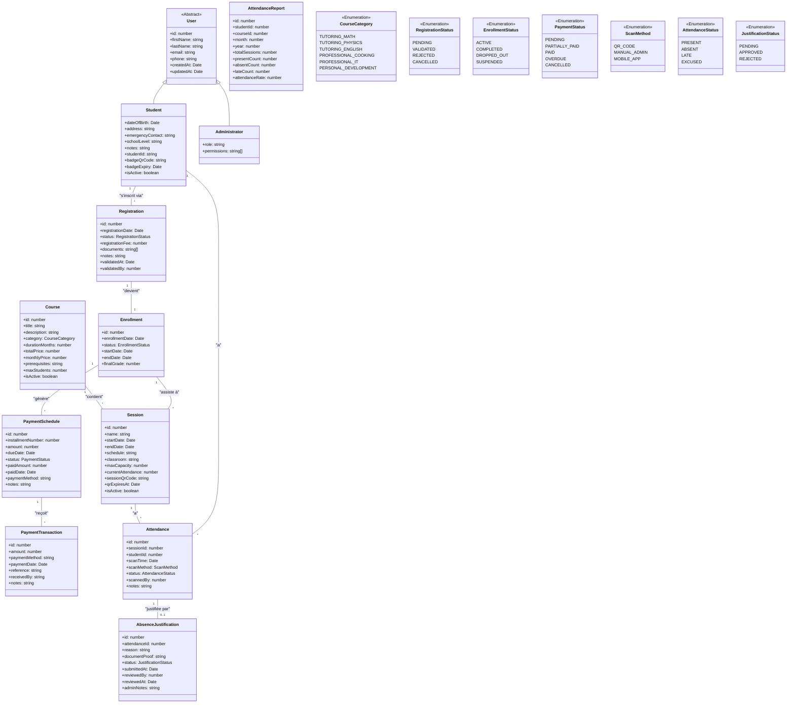
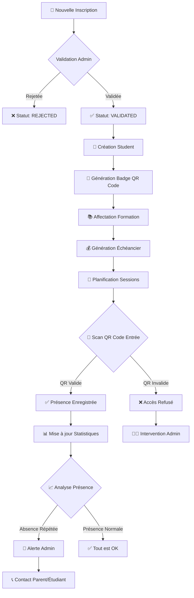
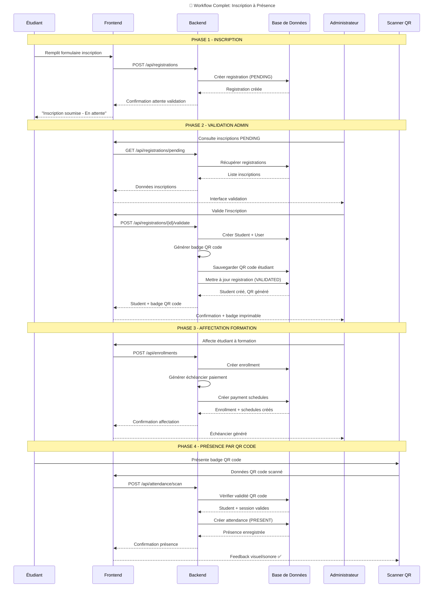
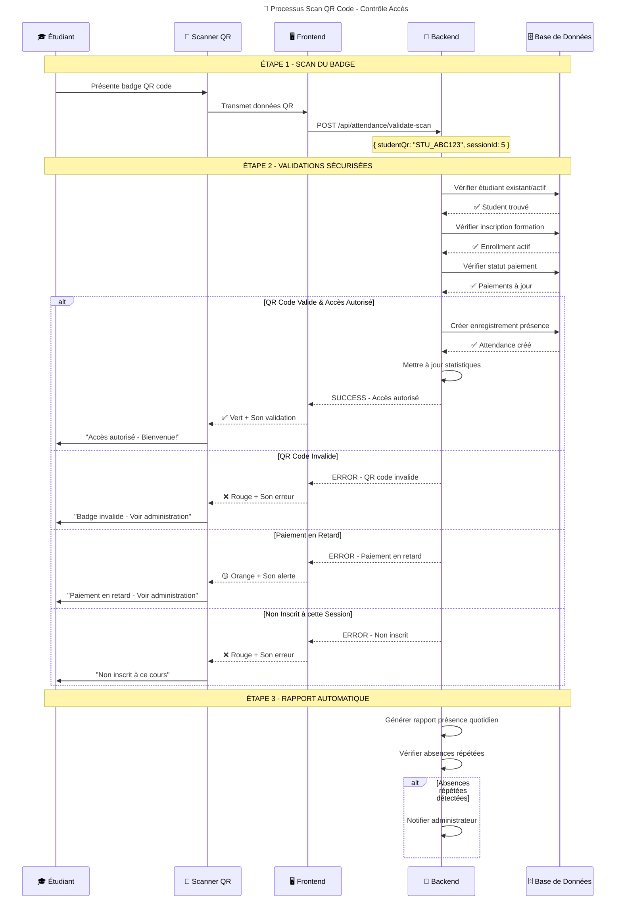
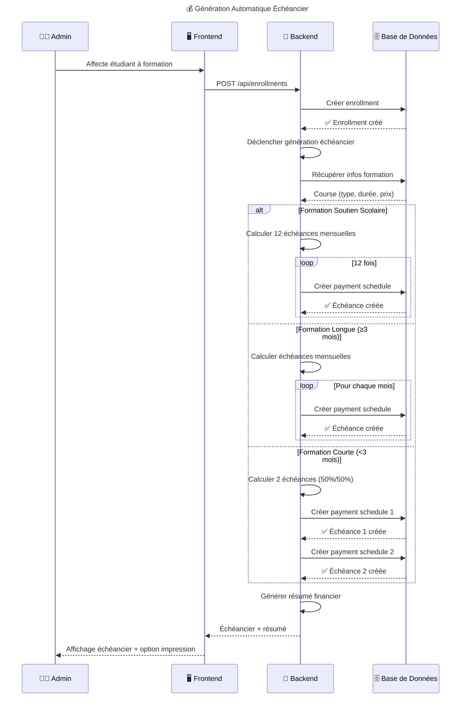

# 🎓 Système Complet de Gestion Scolaire - Refactorisation

## 📊 Nouvelle Architecture Complète



---

## 🔄 Workflow Complet - Du Inscription à la Présence



---

## 📋 Diagramme de Cas d'Utilisation Complet

```mermaid
usecaseDiagram
    title 🎯 Cas d'Utilisation - Système Complet

    actor Admin as "👨‍💼 Administrateur"
    actor Student as "🎓 Étudiant"
    actor System as "🤖 Système Auto"
    actor Parent as "👨‍👩‍👧‍👦 Parent"

    %% ========== GESTION INSCRIPTIONS ==========
    package "Gestion des Inscriptions" {
        usecase UC1 as "Soumettre inscription"
        usecase UC2 as "Valider/rejeter inscription"
        usecase UC3 as "Générer badge étudiant"
        usecase UC4 as "Créer compte étudiant"
    }

    %% ========== GESTION FINANCIÈRE ==========
    package "Gestion Financière" {
        usecase UC5 as "Générer échéancier"
        usecase UC6 as "Enregistrer paiement"
        usecase UC7 as "Suivre retards paiement"
        usecase UC8 as "Générer rapports financiers"
    }

    %% ========== GESTION PRÉSENCES ==========
    package "Gestion des Présences" {
        usecase UC9 as "Scanner QR code entrée"
        usecase UC10 as "Marquer présence/absence"
        usecase UC11 as "Consulter statistiques présence"
        usecase UC12 as "Générer alertes absences"
    }

    %% ========== GESTION PÉDAGOGIQUE ==========
    package "Gestion Pédagogique" {
        usecase UC13 as "Planifier sessions"
        usecase UC14 as "Gérer formations"
        usecase UC15 as "Suivre progression"
        usecase UC16 as "Émettre certificats"
    }

    %% ========== JUSTIFICATIONS ==========
    package "Justifications" {
        usecase UC17 as "Soumettre justification"
        usecase UC18 as "Valider justification"
        usecase UC19 as "Télécharger preuves"
    }

    %% ========== ACTEURS ==========
    Admin --> UC2
    Admin --> UC3
    Admin --> UC4
    Admin --> UC6
    Admin --> UC7
    Admin --> UC8
    Admin --> UC10
    Admin --> UC11
    Admin --> UC12
    Admin --> UC13
    Admin --> UC14
    Admin --> UC16
    Admin --> UC18
    Admin --> UC19

    Student --> UC1
    Student --> UC9
    Student --> UC17

    System --> UC5
    System --> UC12
    System --> UC15

    Parent --> UC12
```

---

## 🔄 Diagrammes de Séquence Détaillés

### Séquence 1: Processus Complet Inscription → Présence



### Séquence 2: Scan QR Code et Gestion Accès



### Séquence 3: Génération Échéancier Paiement



---

## 🏗️ Structure des Données - SQL

```sql
-- Table principale des étudiants avec QR Code
CREATE TABLE students (
    id SERIAL PRIMARY KEY,
    user_id INTEGER REFERENCES users(id),
    student_id VARCHAR(20) UNIQUE NOT NULL,
    date_of_birth DATE,
    address TEXT,
    emergency_contact VARCHAR(255),
    school_level VARCHAR(100),
    badge_qr_code VARCHAR(255) UNIQUE,
    badge_expiry TIMESTAMP,
    is_active BOOLEAN DEFAULT true,
    created_at TIMESTAMP DEFAULT CURRENT_TIMESTAMP,
    updated_at TIMESTAMP DEFAULT CURRENT_TIMESTAMP
);

-- Table des présences avec scan QR Code
CREATE TABLE attendances (
    id SERIAL PRIMARY KEY,
    session_id INTEGER REFERENCES sessions(id),
    student_id INTEGER REFERENCES students(id),
    scan_time TIMESTAMP DEFAULT CURRENT_TIMESTAMP,
    scan_method VARCHAR(20) CHECK (scan_method IN ('QR_CODE', 'MANUAL_ADMIN')),
    status VARCHAR(20) CHECK (status IN ('PRESENT', 'ABSENT', 'LATE', 'EXCUSED')),
    scanned_by INTEGER REFERENCES administrators(id),
    notes TEXT,
    created_at TIMESTAMP DEFAULT CURRENT_TIMESTAMP
);

-- Table des badges QR codes des sessions
CREATE TABLE session_qr_codes (
    id SERIAL PRIMARY KEY,
    session_id INTEGER REFERENCES sessions(id),
    qr_code_data VARCHAR(255) UNIQUE NOT NULL,
    expires_at TIMESTAMP NOT NULL,
    is_active BOOLEAN DEFAULT true,
    created_at TIMESTAMP DEFAULT CURRENT_TIMESTAMP
);

-- Index pour performances
CREATE INDEX idx_students_qr_code ON students(badge_qr_code);
CREATE INDEX idx_attendances_session_date ON attendances(session_id, scan_time);
CREATE INDEX idx_attendances_student_session ON attendances(student_id, session_id);
CREATE INDEX idx_session_qr_codes_active ON session_qr_codes(is_active, expires_at);
```

---

## 🚀 API Endpoints Clés

### Gestion des Présences par QR Code
```typescript
// Valider un scan QR code
POST /api/attendance/validate-scan
Body: {
  studentQrCode: string,
  sessionQrCode: string, 
  scanTime: Date
}
Response: {
  success: boolean,
  student: StudentInfo,
  accessGranted: boolean,
  message: string
}

// Générer QR code pour une session
POST /api/sessions/:id/generate-qr
Response: {
  qrCode: string,
  expiresAt: Date,
  session: SessionInfo
}

// Marquer présence manuelle (admin)
POST /api/attendance/manual
Body: {
  studentId: number,
  sessionId: number,
  status: 'PRESENT' | 'ABSENT' | 'LATE'
}

// Obtenir les présences d'une session
GET /api/sessions/:id/attendance
Response: {
  session: Session,
  attendances: Attendance[],
  summary: {
    total: number,
    present: number,
    absent: number,
    late: number
  }
}
```

### Gestion des Badges Étudiants
```typescript
// Générer nouveau badge étudiant
POST /api/students/:id/generate-badge
Response: {
  qrCode: string,
  expiryDate: Date,
  badgeUrl: string // PDF printable
}

// Révoquer badge (en cas de perte)
PUT /api/students/:id/revoke-badge
Response: { success: boolean, message: string }

// Valider badge étudiant
GET /api/students/validate-badge/:qrCode
Response: {
  isValid: boolean,
  student: StudentInfo,
  message: string
}
```

---

## 🎯 Ce Qui Manquait - Correctifs Apportés

### ✅ Problèmes Identifiés et Résolus

1. **❌ Absence de lien entre QR code et contrôle d'accès**
   - ✅ **Ajouté**: Validation du statut de paiement avant accès
   - ✅ **Ajouté**: Vérification de l'inscription à la session

2. **❌ Workflow incomplet inscription → présence**
   - ✅ **Corrigé**: Processus séquentiel clair
   - ✅ **Ajouté**: Génération automatique du badge après validation

3. **❌ Gestion des erreurs de scan insuffisante**
   - ✅ **Amélioré**: Messages d'erreur spécifiques
   - ✅ **Ajouté**: Feedback visuel/sonore immédiat

4. **❌ Sécurité des QR codes faible**
   - ✅ **Renforcé**: Dates d'expiration
   - ✅ **Ajouté**: Révoquation des badges perdus

5. **❌ Intégration financière manquante**
   - ✅ **Intégré**: Blocage accès si paiements en retard
   - ✅ **Ajouté**: Lien entre présence et échéancier

### 🔧 Nouveaux Composants à Implémenter

1. **Service de Génération QR Code**
```typescript
class QrCodeService {
  generateStudentBadge(studentId: number): Promise<QrBadge>
  generateSessionQr(sessionId: number): Promise<SessionQr>
  validateQrCode(qrData: string): Promise<ValidationResult>
  revokeQrCode(qrData: string): Promise<void>
}
```

2. **Système de Contrôle d'Accès**
```typescript
class AccessControlService {
  checkStudentAccess(studentId: number, sessionId: number): Promise<AccessStatus>
  validatePaymentStatus(studentId: number): Promise<boolean>
  logAccessAttempt(attempt: AccessAttempt): Promise<void>
}
```

3. **Gestionnaire de Présences**
```typescript
class AttendanceService {
  recordAttendance(scanData: ScanData): Promise<AttendanceRecord>
  generateDailyReport(date: Date): Promise<AttendanceReport>
  checkRepeatedAbsences(studentId: number): Promise<AbsenceAlert[]>
}
```

Cette architecture complète assure un flux cohérent de l'inscription à la présence quotidienne, avec un système de QR code sécurisé et intégré aux aspects financiers et pédagogiques.


Nous allons refactoriser le système pour intégrer la gestion des absences par QR code. Le processus est le suivant :

Chaque étudiant possède un badge avec un QR code unique (généré lors de l'inscription et validation).

Chaque session de cours a un QR code unique (généré par l'administrateur pour la session).

Avant d'entrer en cours, l'étudiant présente son badge à l'administrateur (ou à un terminal) qui scanne le QR code.

Le système enregistre la présence de l'étudiant pour la session du jour.

Nous devons donc :

Ajouter un champ QR code dans la table students (et peut-être un champ expiration pour la sécurité).

Créer une table session_qr_codes pour stocker les QR codes des sessions (liés à une session et avec une expiration).

Modifier la table attendances pour enregistrer la méthode de scan (QR code) et l'horodatage.

Étapes détaillées :

Génération du QR code de l'étudiant :

Lors de la validation de l'inscription, générer un QR code unique pour l'étudiant (par exemple, une chaîne aléatoire) et le stocker dans students.qr_code.

Prévoir un mécanisme de renouvellement du QR code (pour la sécurité) : par exemple, expiration après un an ou en cas de perte.

Génération du QR code de la session :

Avant chaque session, l'administrateur génère un QR code pour la session (qui expire à la fin de la session).

Stocker dans session_qr_codes (id, session_id, qr_code_data, expires_at, is_active).

Processus de scan :

L'administrateur scanne d'abord le QR code de la session (pour activer la session de scan) OU on peut avoir un écran avec le QR code de la session affiché et l'admin scanne le QR code de l'étudiant.

Ensuite, l'administrateur scanne le QR code de l'étudiant.

Le système vérifie :

que le QR code de la session est valide (non expiré) et actif,

que le QR code de l'étudiant est valide,

que l'étudiant est bien inscrit à la formation de cette session.

Enregistrement de la présence dans attendances (session_id, student_id, scan_time, status='PRESENT').

Gestion des absences :

Les absences sont enregistrées automatiquement pour les étudiants non scannés (ou manuellement par l'admin) à la fin de la session.

Justification des absences :

L'étudiant peut justifier une absence via son portail (avec preuve).

L'administrateur valide ou rejette la justification.

Modifications de la base de données :

Table students : ajouter qr_code (string) et qr_code_expiry (datetime).

Table session_qr_codes :

id (PK)

session_id (FK vers sessions)

qr_code_data (string)

expires_at (datetime)

is_active (boolean)

Table attendances :

Ajouter scan_method (enum: 'QR_CODE', 'MANUAL') et scan_time (datetime).

Peut-être ajouter scanned_by (admin qui a scanné) si nécessaire.

Nous allons maintenant mettre à jour les diagrammes.

Diagramme de classes (simplifié pour la gestion des absences par QR code)


classDiagram
    class Student {
        +id: number
        +firstName: string
        +lastName: string
        +email: string
        +phone: string
        +dateOfBirth: Date
        +address: string
        +emergencyContact: string
        +schoolLevel: string
        +notes: string
        +qrCode: string
        +qrCodeExpiry: Date
        +createdAt: Date
        +updatedAt: Date
    }

    class Session {
        +id: number
        +name: string
        +startDate: Date
        +endDate: Date
        +schedule: string
        +classroom: string
        +maxCapacity: number
        +createdAt: Date
        +updatedAt: Date
    }

    class SessionQRCode {
        +id: number
        +sessionId: number
        +qrCodeData: string
        +expiresAt: Date
        +isActive: boolean
        +createdAt: Date
    }

    class Attendance {
        +id: number
        +sessionId: number
        +studentId: number
        +scanTime: Date
        +scanMethod: ScanMethod
        +status: AttendanceStatus
        +notes: string
        +scannedBy: number
        +createdAt: Date
    }

    class AbsenceJustification {
        +id: number
        +attendanceId: number
        +reason: string
        +documentProof: string
        +status: JustificationStatus
        +reviewedBy: number
        +reviewedAt: Date
        +adminNotes: string
        +createdAt: Date
    }

    class Administrator {
        +id: number
        +userId: number
        +role: string
        +permissions: string[]
    }

    Student "1" -- "*" Attendance : a
    Session "1" -- "*" Attendance : a
    Session "1" -- "1" SessionQRCode : génère
    Attendance "1" -- "0..1" AbsenceJustification : justifiée par
    Administrator "1" -- "*" Attendance : scanné par
    Administrator "1" -- "*" AbsenceJustification : traité par

    <<Enumeration>> ScanMethod
    ScanMethod : QR_CODE
    ScanMethod : MANUAL

    <<Enumeration>> AttendanceStatus
    AttendanceStatus : PRESENT
    AttendanceStatus : ABSENT
    AttendanceStatus : LATE
    AttendanceStatus : EXCUSED

    <<Enumeration>> JustificationStatus
    JustificationStatus : PENDING
    JustificationStatus : APPROVED
    JustificationStatus : REJECTED


    sequenceDiagram
    participant Admin as Administrateur
    participant System as Système
    participant DB as Base de données

    Note over Admin,DB: Génération du QR code de la session
    Admin->>System: Générer QR code pour la session
    System->>DB: Créer SessionQRCode (expiresAt = fin de session)
    DB-->>System: SessionQRCode créé
    System-->>Admin: QR code de la session (affiché)

    Note over Admin,DB: Scan de l'étudiant
    Admin->>System: Scan du QR code de l'étudiant (avec session active)
    System->>DB: Vérifier SessionQRCode (valide et actif)
    DB-->>System: SessionQRCode valide
    System->>DB: Vérifier Student (QR code valide et non expiré)
    DB-->>System: Student trouvé
    System->>DB: Vérifier que l'étudiant est inscrit à la formation de la session
    DB-->>System: Inscription trouvée
    System->>DB: Créer Attendance (PRESENT, scan_method=QR_CODE, scan_time=now)
    DB-->>System: Attendance créé
    System-->>Admin: Confirmation de présence enregistrée


    


